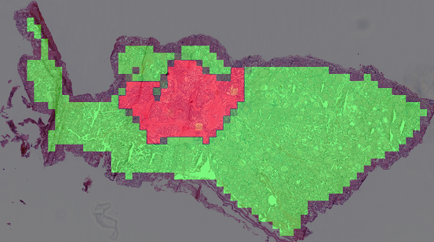

pyslide - Python whole slide image analysis toolkit
============
[](https://app.codacy.com/app/PingjunChen/pyslide?utm_source=github.com&utm_medium=referral&utm_content=PingjunChen/pyslide&utm_campaign=Badge_Grade_Dashboard)
[](https://circleci.com/gh/PingjunChen/pyslide)
[](https://pyslide.readthedocs.io/en/latest/?badge=latest)

[](https://codecov.io/gh/PingjunChen/pyslide)
[](https://pepy.tech/project/pyslide)




Please consider `star` this repo if you find [pyslide](https://github.com/PingjunChen/pyslide) to be helpful for your work.

Installation
------------
To install pyslide, apt dependences before pip:
```alpha
sudo apt-get install openslide-tools
sudo apt-get install libgeos-dev
pip install -r requirements.txt
pip install pyslide==0.4.2
```

Usage
------------

Documentation
------------
Hosted in [https://pyslide.readthedocs.io](https://pyslide.readthedocs.io), powered by [readthedocs](https://readthedocs.org) and [Sphinx](http://www.sphinx-doc.org).

License
------------
[pyslide](https://github.com/PingjunChen/pyslide) is free software made available under the MIT License. For details see the [LICENSE](LICENSE) file.

Contributors
------------
See the [AUTHORS.md](AUTHORS.md) file for a complete list of contributors to the project.

Contributing
------------
``pyslide`` is an open source project and all whole slide image analysis related functions are very welcome to contribute. An easy way to get started is by suggesting a new enhancement on the [Issues](https://github.com/PingjunChen/pyslide/issues). If you have found a bug, then either report this through [Issues](https://github.com/PingjunChen/pyslide/issues), or even better, make a fork of the repository, fix the bug and then create a [Pull Request](https://github.com/PingjunChen/pyslide/pulls) to get the fix into the master branch.
