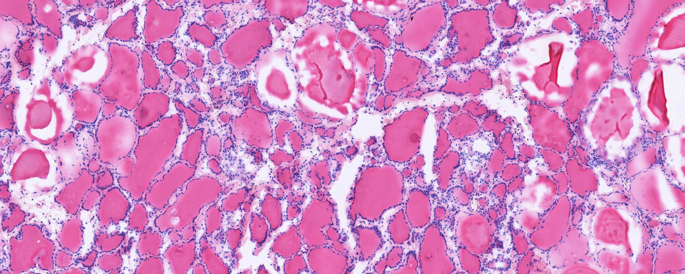

# **pyslide - Whole slide image analysis toolbox**
[](https://travis-ci.org/PingjunChen)
[](https://pyslide.readthedocs.io/en/latest/?badge=latest)




## *Installation*
To install pyslide, simple use pip:
```
$ pip install pyslide
```

## Usage


## Documentation
Hosted in [https://pyslide.readthedocs.io](https://pyslide.readthedocs.io), powered by [readthedocs](https://readthedocs.org) and [Sphinx](http://www.sphinx-doc.org).


## License
[pyslide](https://github.com/PingjunChen/pyslide) is free software made available under the MIT License. For details see the [LICENSE](LICENSE) file.

## Contributors
See the [AUTHORS.md](AUTHORS.md) file for a complete list of contributors to the project.

## Contributing
``pyslide`` is an open source project and all whole slide image analysis related functions are very welcome to contribute. An easy way to get started is by suggesting a new enhancement on the [Issues](https://github.com/PingjunChen/pyslide/issues). If you have found a bug, then either report this through [Issues](https://github.com/PingjunChen/pyslide/issues), or even better, make a fork of the repository, fix the bug and then create a [Pull Request](https://github.com/PingjunChen/pyslide/pulls) to get the fix into the master branch.
